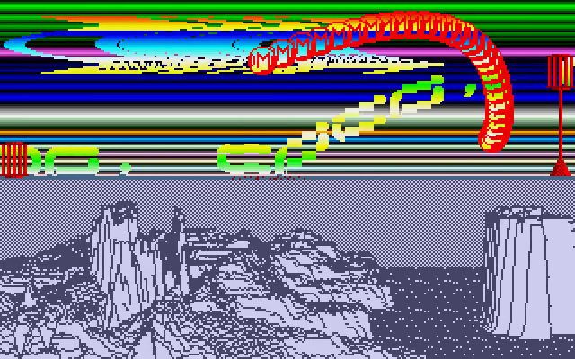
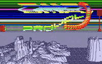

# Larcociel 3 Go

A Go/Ebitengine conversion of **DMA Intro 3 (French Demo)** by **Larcociel of
DMA**, using Demo Construction Kit **v1.0.13**. The original chip soundtrack is
credited to **Jason C. Brooke**.

<!-- Project showcase -->
## Screenshots

[](docs/media/screenshot-1.png)

A curved colorful scroller and red sprite trail above the illustrated landscape.

## Video

[](https://github.com/olivierh59500/go-larcociel3/raw/refs/heads/main/docs/media/preview.mp4)

**[Watch or download the 24-second MP4 preview with sound](https://github.com/olivierh59500/go-larcociel3/raw/refs/heads/main/docs/media/preview.mp4)**

This preview is captured from the Go production.

The animated image is silent; the MP4 includes the soundtrack.

<!-- End project showcase -->

## Production notes

```sh
go run ./cmd/larcociel3
go run ./cmd/larcociel3 -mute
```

Space or Escape closes the intro. The 320 × 200 screen runs at 50 Hz. Its layers
combine a row-deformed DMA logo, a curved French scrolltext, a trail of red DMA
sprites, independently colored raster bands, an animated landscape and a
four-frame bird moving across the lower scene.

The original word tables, fonts, bitmaps, landscape program, palette banks and
soundtrack are embedded. The scrolling follows forty authored eight-pixel
columns. DCK owns the strip-history transport, common Scrolling renderer,
retained sprite batches and YM playback. Separate palette banks preserve the
background/logo colors and the landscape's two brightness levels. A test
compares the sprite histories, velocities and acceleration against an
independent 149-frame 68000 checkpoint.

Runtime drawing uses no GPU pixel readback. Only the lower indexed landscape
is uploaded as its authored frame program advances. The music uses YM6 and is
opened through DCK's sound facade.

```sh
go test ./...
go vet ./...
go run ./cmd/larcociel3 -capture captures/preview -frame 500 -frames 1
go run ./cmd/video
```

DCK's exporter writes a three-minute 50 fps H.264/AAC MP4, a PNG poster and a
JSON report under `recordings/`, at 640 × 400 pixels. Graphics and music use one
simulation clock. The website uses a VP9/Opus WebM copy.

Original production: [Demozoo](https://demozoo.org/productions/79462/).

## Android

```sh
./scripts/run-android.sh --build-only
./scripts/run-android.sh
```

The build uses Java 17, Android SDK 36, NDK 28.2, Ebitengine 2.9.11 and the
included Gradle wrapper. It produces an ARM64 APK in
`android/app/build/outputs/apk/debug/app-debug.apk`. The host initializes Go
rendering and audio after the Android context is available, preserves landscape
orientation and keeps the screen awake. Android Back closes the activity.
The install command requires one authorized USB device; `ANDROID_SERIAL`
can select a specific device. Build products and machine settings stay local.
